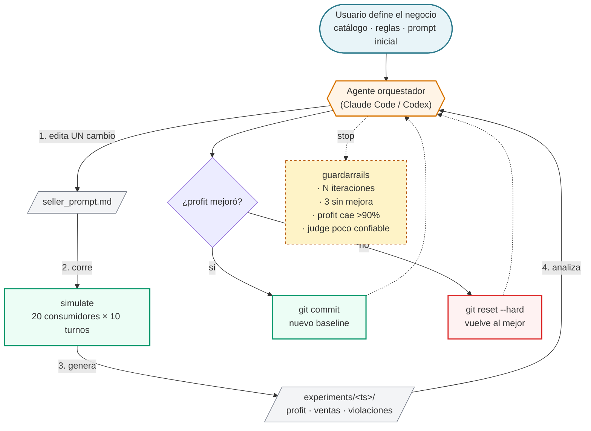

# Sales Arena — Loop macro de optimización

## Cómo narrarlo (orden 1→4)

1. El orquestador **edita un solo cambio** en el prompt — disciplina clave del método.
2. **Simula** una tanda completa de clientes contra ese prompt (20 conversaciones pseudo-paralelas).
3. La simulación deja un **artefacto inmutable** en disco con todas las conversaciones, ventas y violaciones.
4. El orquestador **lee, decide, y commitea** — git es la memoria del baseline.

El loop nunca degrada el mejor resultado: si el profit empeora, hace `reset` al último commit ganador.
