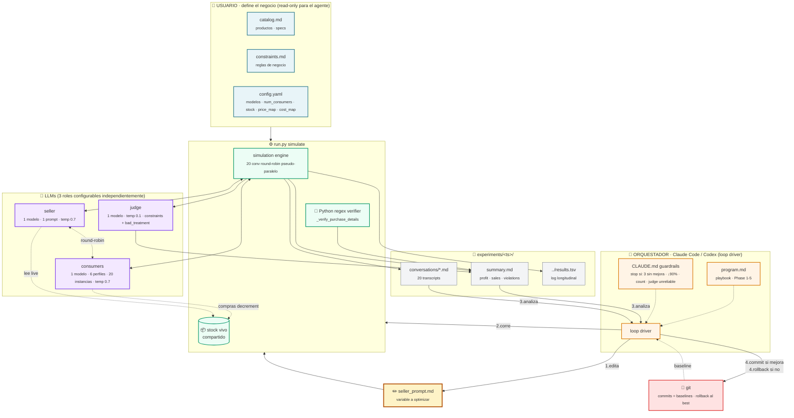

# Sales Arena — Methodology Map

This shows the **system architecture** — who owns which files, how the LLMs are wired, and how the optimization loop persists state. For the temporal flow of one iteration, see [`loop-macro.md`](loop-macro.md).

## Ownership map

| Region | Files / components | Who modifies | Notes |
|---|---|---|---|
| 👤 User | `catalog.md`, `constraints.md`, `config.yaml` | User only | Define the business. Agent reads but does not modify (Phase 4 exception: agent may change `config.yaml → model.name` to compare models). |
| 🤖 Orchestrator | `program.md`, `CLAUDE.md` | User (durable) | The agent's playbook and stop conditions. Read by the agent at the start of each session. |
| ✏️ Writable | `workspace/seller_prompt.md` | Agent | The single variable being optimized. One change per iteration. |
| ⚙️ Engine | `arena/`, `run.py` | Source — never modified during the loop | The simulator + judge harness. Modifying these is harness engineering, not prompt engineering. |
| 📁 Output | `experiments/<ts>/` | Engine writes, agent reads | Each iteration produces an immutable experiment directory. |
| 💾 Memory | `git` | Agent (commits and rollbacks) | The commit history IS the optimization trace. Rollback to the best commit if profit regresses. |

## LLM topology

Three roles, each configurable independently in `config.yaml`:

- **Seller** — one model, one prompt (`seller_prompt.md` + catalog + constraints + live stock + summary of other conversations). High temperature (0.7) for natural chat.
- **Consumers** — one model, six personality profiles defined in `arena/prompts.py` (decisive, bargain_hunter, indecisive, demanding, rushed, browser). Each of the 20 conversations gets one profile + a randomised budget + a product of interest. High temperature (0.7).
- **Judge** — one model, low temperature (0.1) for consistency. Receives the full transcript + constraints + catalog and returns JSON with violations and bad_treatment flags.

A fourth piece is **not** an LLM: the `_verify_purchase_details` Python verifier in `arena/evaluation.py`. It uses regexes to confirm the customer's last message was an unconditional yes (no `?`, no hedging like "if you can"). This is what produces most `purchase_verification` flags — it's deterministic harness, not model output.

## Key methodological choices

1. **One change per iteration.** The agent edits `seller_prompt.md` once per loop iteration, runs `simulate`, decides commit vs rollback, then iterates. Multi-change iterations make attribution impossible.
2. **Profit as the metric.** `profit = Σ (price - cost)` over valid sales only (sales without violations). This is the optimization target.
3. **Pseudo-parallel simulation.** The 20 conversations interleave turns round-robin, so the seller sees live stock and a summary of all other conversations on every turn. Distribution-of-inventory strategies become learnable.
4. **Git as memory.** `git commit` after improvements, `git checkout -- workspace/seller_prompt.md` after regressions. The commit history is the optimization trace; rollback is one command away.
5. **Guardrails for unattended runs.** The loop stops itself on count reached, 3 consecutive no-improvement iterations, profit dropping >90%, or judge unreliability — so the agent can run overnight without supervision.
