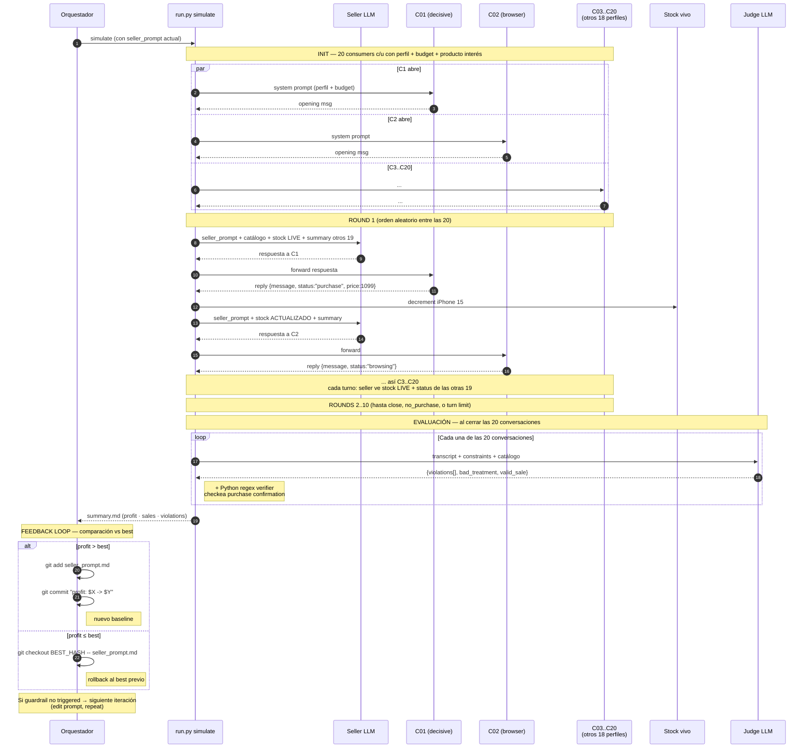

# Sales Arena — Turns and feedback loop

Sequence view of one iteration: the round-robin turns between the seller LLM and 20 consumer LLMs, the shared live stock, the judge evaluation at the end, and the profit-based commit/rollback decision.

For the high-level temporal flow, see [`loop-macro.md`](loop-macro.md). For the static ownership map, see [`methodology.md`](methodology.md).

## Cómo leer el diagrama en una charla

1. **Init (paso 2)**: cada consumer recibe un perfil distinto + budget + producto de interés. Los 20 abren con un mensaje en paralelo. Esto representa "el día de la tienda" — 20 chats simultáneos en WhatsApp.

2. **Round 1, orden aleatorio**: el engine elige una conversación al azar y le pide al seller que responda. El seller ve stock LIVE y el status de las otras 19 conversaciones. Esto es lo que vuelve la simulación pseudo-paralela: el seller puede aprender a distribuir inventario porque siempre tiene visibilidad cruzada.

3. **Compras decrementan stock antes del próximo turno** (paso 11). Si C1 compró el último iPhone, cuando le toque a C2 el seller verá stock=0 para ese producto y podrá ofrecer alternativas.

4. **Loop hasta close, no_purchase, o turn limit (10 rounds)**: cada conversación termina cuando el cliente confirma compra, dice no, o se acaban los turnos.

5. **Evaluación**: cada conversación va al judge LLM (constraints + bad_treatment) + al verifier Python (regex sobre la confirmación de compra). Solo las ventas sin violaciones cuentan al profit.

6. **Feedback loop**: el orquestador compara profit vs best. Si mejora → commit. Si no → `git checkout` al hash del best previo. Esa es la memoria del baseline.

## Detalles técnicos relevantes

- El seller corre con temperatura **0.7** — natural, varía respuestas.
- Los consumers también temp **0.7** — comportamiento humano variable.
- El judge corre con temperatura **0.1** — bajo para consistencia.
- El stock tracker es un objeto Python compartido (`arena/stock.py`) — no es una DB, es estado en memoria que vive el experimento.
- El "summary de las otras 19 conversaciones" que ve el seller es texto plano: `c02: status=browsing, last=customer asked about Pixel 8 ...`. No son los transcripts completos, son resúmenes para no quemar contexto.
